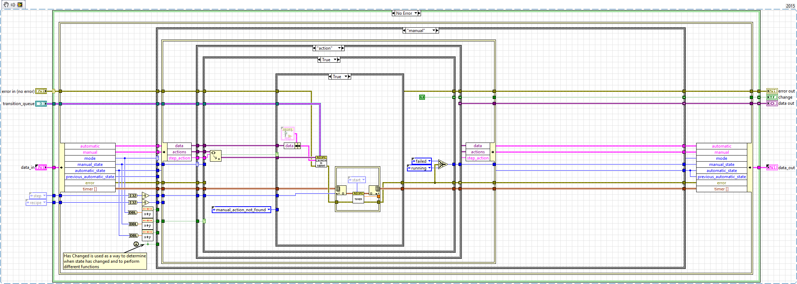
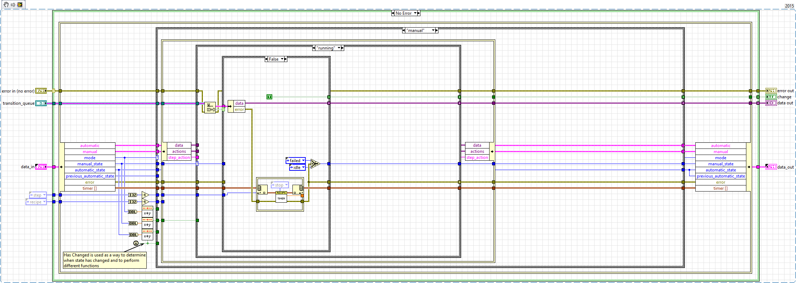
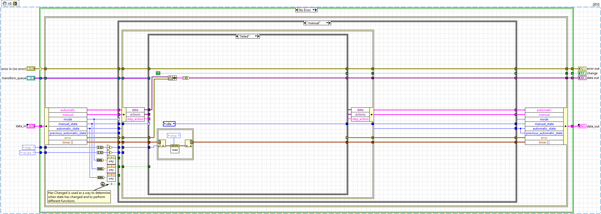
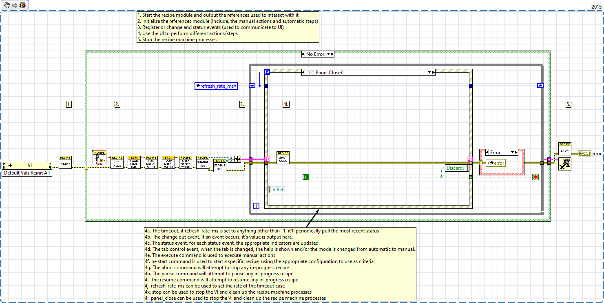

# lv-recipe-machine

This is an architecture/design pattern arranged behind the idea of a recipe machine, although it can be used as a template (via copy+paste) it can also be used as a dependency/package and you can develop an application layer on top of it (this is how the example is implemented).

I'll be honest and say that I've written this specific piece of code approximately three times (2013, 2016 and 2020). I don't think i've covered every possible use case of a recipe machine, but i think i've captured every feature I've needed/used so far.

## Installation

AS usual, i'm super partial to VI package manager, install it using the vip package you can create with the vipb file OR just copy and paste it into your repo, the two options aren't identical, but functionally they're the same (unless you want to switch between the two).

The example is kinda weird right now, haven't researched a better way to distribute it, there's a vipb for it, but it's kinda janky, feel free to clone the repo, install the dependencies (under source/_dependencies) and then open the examples project.

## Description

The recipe machine is a general purpose and __Static__  [state machine](https://en.wikipedia.org/wiki/Finite-state_machine) that can execute recipes and manual actions.  It has the building blocks to create recipes that can perform static steps (with predefined data) or more dynamic steps, using data from other steps to make decisions; there's also the ability to execute multiple steps simultaneously, aggregate their information and use it to create output or make decisions.

Each executed step (whether manual or automatic mode) is relatively serialized (with the exception of launch types); once each step is started, the recipe logic will check the transition queue to get the results of the step.  The step itself will also use the change_in event to signal to the recipe logic that a change has occurred and the recipe logic should execute now rather than waiting for a timeout.

For automatic mode, the internal logic will advance the recipe index by one for each successful step, alternatively if a failure occurs it'll transition to the _Failure_ state, otherwise criteria steps can provide an alternative index for the next step.

### Mode: Manual

When manual mode is enabled, the recipe machine will execute a single manual action. Generally the states will go from idle > action > running > idle. Feel free to highlight execution on the logic while it's running a manual command, the images below can give you a general idea  of how it executes:

### Mode: Automatic

Recipe machine is useful for situations where you have a handful of functions and want to use them in different, but reproducible ways. The easiest examples are things like car washes, or coffee makers etc. It's organized into five kinds of steps/processes.

* manual actions: these actions are performed atomically, they'll run and provide feedback on results
* automatic steps: these actions are a part of a recipe and can share data between different steps
* automatic criteria: these actions can be used to make a decision, it can change the next step and or use recipe data to determine failure/success etc
* transitions: these are steps that are executed when changing the automatic state (e.g. running > paused, running > stopped etc)
* launcher(s): these are steps that can be used to launch one or more processes asynchronously, wait for their response vi a local transition queue and then aggregate that response data

Generally, the automatic logic will go from idle > running > paused/stopped/failed > idle. Feel free to use highlight execution to see the flow. Automatic steps are unique in that there's a need to determine if a state has just changed, it used that information to launch the step, and the lack thereof to determine when it should wait for a auto transition.

")

")

")

")

")

")

")

## Disclaimers

Personally, it's unfortunate that I did this, but to be honest creating a recipe machine where the steps aren't integrated into the recipe machine creates this problem (so one evil for another): you __WILL__ have to create steps that have the same terminals as the vi_reference types to inject them into the recipe machine. This means that you will be unable to create any steps that __DON'T__ break data flow using a global of some type (please god use a functional global) to get process data in and out of those steps (e.g. OTHER modules).

Unfortunately this means that the barrier for entry is still relatively high since you're forced to use an architecture that breaks data flow without causing a race condition. __Example_01 has an example of this with how the transitions can stop a running auto_wait or manual_wait step.__

## Example 01

Example 01, is pretty basic, there are a handful of comments, so feel free to look them over and get a feel for how it works. This should cover about 90% of the use cases, it probably doens't take care of more complex transitions.

")

")

")

